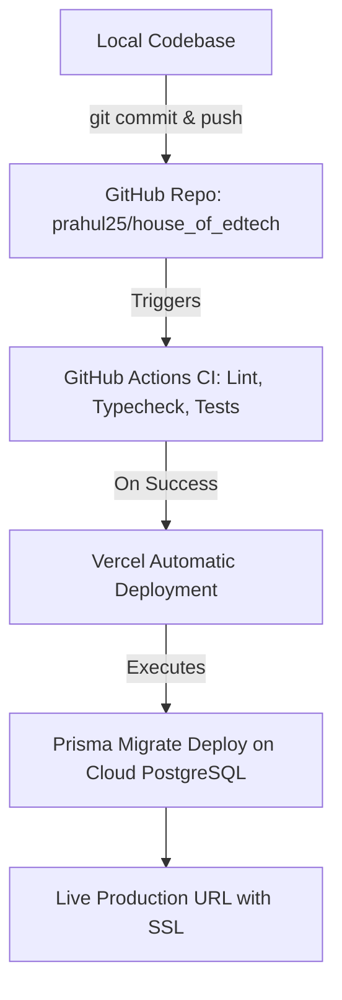

# House of Edtech – Fullstack Developer Assignment Plan
**Candidate Name:** Rahulkumar Pali  
**GitHub Profile:** [github.com/prahul25](https://github.com/prahul25)  
**Repository:** [github.com/prahul25/house_of_edtech](https://github.com/prahul25/house_of_edtech)  
**LinkedIn Profile:** [linkedin.com/in/rahulkumarpal25](https://www.linkedin.com/in/rahulkumarpal25/)  
**Live Deployment:** *To be linked upon Vercel deployment*

---

## 1. Project Concept: EduFlow AI
> **Mandate from House of Edtech:** *"We don't expect a basic CRUD application. Please don’t build to-do lists, task managers and basic crud applications. We want you to showcase your intellect and approach to developing impactful applications..."*

**EduFlow AI** is a modern, full-stack **Adaptive Course Studio & Student Learning Experience Platform** specifically tailored to the EdTech sector.

### Key Capabilities:
- **Dual-Role Access Control (RBAC):**
  - **Instructors / Educators:** Create and manage complete curricula, organize courses into sequential modules and lessons, author interactive quizzes, track student enrollment and progress analytics, and leverage AI to auto-generate syllabi and test questions.
  - **Students:** Explore a rich course catalog, enroll in courses, study lessons with rich markdown notes and video embeds, chat with a context-aware AI Lesson Tutor, take scored quizzes with instant explanations, and track learning progress.
- **Relational Domain Entities (Comprehensive CRUD):**
  - Courses (Draft / Published, pricing, categorization, level)
  - Modules & Lessons (Reordering, rich content, reading time, resources)
  - Assessments & Quizzes (Multiple choice, answer justifications, attempt logs)
  - Enrollments & Completion Tracking (Module & lesson checkoffs, scores)
- **AI Integrations (Optional Skill Showcase):**
  - **AI Syllabus Builder:** Generates complete course outlines and module structures from a single topic prompt.
  - **In-Lesson AI Tutor:** Answers student questions strictly based on current lesson content.
  - **AI Quiz Generator:** Automatically drafts assessment questions from lesson text.

---

## 2. Credentials & Environment Variables Required

| Key | Required For | How to Get (Free) |
|---|---|---|
| `DATABASE_URL` | PostgreSQL Database | Free cloud PostgreSQL from [Neon.tech](https://neon.tech) or [Supabase](https://supabase.com). Takes 1 minute to create. |
| `NEXTAUTH_SECRET` | Secure JWT session encryption | Generated automatically via `openssl rand -base64 32`. |
| `NEXTAUTH_URL` | Base URL for auth callbacks | `http://localhost:3000` locally, or Vercel URL in production. |
| `GEMINI_API_KEY` | AI course & quiz generation | Free API key from [Google AI Studio](https://aistudio.google.com/). |

---

## 3. Step-by-Step Task Breakdown & Commit Plan

Every single task will be verified, marked as completed `[x]`, and committed with a clean conventional commit message.

### Phase 1: Project Scaffolding & Architecture
- [x] **Task 1.1: Next.js Foundation & Tooling**
  - Setup Next.js with TypeScript, Tailwind CSS, Lucide React icons, and utility helpers (`clsx`, `tailwind-merge`).
  - *Commit message:* `chore: initialize Next.js with TypeScript, Tailwind CSS, and layout structure`
- [ ] **Task 1.2: Relational Database Schema with Prisma ORM**
  - Define schema: User, Account, Course, Module, Lesson, Quiz, Question, Choice, Enrollment, LessonProgress, QuizAttempt.
  - Setup database client with connection pooling.
  - *Commit message:* `feat(db): design and configure Prisma relational schema for course platform`
- [ ] **Task 1.3: Responsive Shell Layout & Compliance Footer**
  - Build top navigation bar, responsive mobile menu, user profile pill, and mandatory footer displaying Rahulkumar Pali, GitHub, and LinkedIn links.
  - *Commit message:* `feat(ui): implement responsive shell layout, navigation, and compliance footer`

### Phase 2: Authentication, Security & RBAC
- [ ] **Task 2.1: NextAuth Core & Password Security**
  - Configure NextAuth with Credentials Provider, bcrypt password hashing, and JWT session handling containing user role (`INSTRUCTOR` vs `STUDENT`).
  - *Commit message:* `feat(auth): implement secure credentials authentication and RBAC with JWT`
- [ ] **Task 2.2: Authentication UI & Protected Middleware**
  - Build Sign In and Sign Up pages with role selection, form validation, and Next.js middleware for route protection.
  - *Commit message:* `feat(auth): create sign-in/sign-up forms with route protection middleware`

### Phase 3: Instructor Course Studio (Full CRUD)
- [ ] **Task 3.1: Course Management CRUD**
  - Server actions / API endpoints with Zod schema validation for creating, editing, publishing, drafting, and deleting courses.
  - Instructor dashboard with course cards, metrics, and actions.
  - *Commit message:* `feat(course): implement course management CRUD with Zod validation`
- [ ] **Task 3.2: Module & Lesson Builder**
  - Interactive UI to add, reorder, update, and delete modules and individual lessons with markdown/video content.
  - *Commit message:* `feat(course): build module and lesson builder with interactive management`
- [ ] **Task 3.3: Assessment & Quiz Creator**
  - Build quiz editor supporting multiple-choice questions, correct answer selection, and answer explanations.
  - *Commit message:* `feat(quiz): implement assessment creation and question management system`

### Phase 4: Student Learning Portal & Progress Engine
- [ ] **Task 4.1: Course Marketplace / Catalog**
  - Public & authenticated catalog with live search, category filters, difficulty badges, and course overview page.
  - *Commit message:* `feat(catalog): create searchable course catalog with filtering and preview views`
- [ ] **Task 4.2: Course Enrollment & Interactive Lesson Viewer**
  - One-click enrollment, sequential lesson navigation, and real-time completion checkmark tracking.
  - *Commit message:* `feat(learning): implement enrollment flow and interactive lesson progress tracking`
- [ ] **Task 4.3: Interactive Quiz-Taking Engine**
  - Quiz execution interface, instant auto-grading, answer rationale reveal, and attempt history persistence.
  - *Commit message:* `feat(quiz): build interactive quiz-taking engine with instant score calculation`

### Phase 5: AI-Powered Add-on Features
- [ ] **Task 5.1: AI Syllabus & Curriculum Generator**
  - Form where instructors enter a subject topic and target audience; AI generates a complete multi-module curriculum.
  - *Commit message:* `feat(ai): integrate AI-powered course syllabus and module generator`
- [ ] **Task 5.2: In-Lesson AI Learning Assistant**
  - Floating/embedded chat drawer where students can ask questions about the current lesson, with answers grounded in lesson notes.
  - *Commit message:* `feat(ai): implement in-lesson contextual AI tutor assistance`
- [ ] **Task 5.3: AI Quiz Generator**
  - Instructors click "Generate Quiz from Lesson Content", and AI generates 3-5 high-quality questions with answer keys.
  - *Commit message:* `feat(ai): add automatic quiz generation from lesson notes using AI`

### Phase 6: Testing, Optimization & Quality Assurance
- [ ] **Task 6.1: Automated Test Suite**
  - Unit and integration tests for validation schemas, authentication helpers, and business logic.
  - *Commit message:* `test: add unit and integration test suite for validation and CRUD operations`
- [ ] **Task 6.2: Performance, Accessibility & Error Handling**
  - Optimized metadata, caching, loading skeletons, accessible ARIA attributes, and error boundaries.
  - *Commit message:* `perf: optimize SSR caching, loading skeletons, and accessibility standards`
- [ ] **Task 6.3: Production Documentation (README.md)**
  - Architecture overview, entity relationship diagram (ERD), API documentation, security considerations, and local setup guide.
  - *Commit message:* `docs: add comprehensive architecture, security mitigation, and setup documentation`

### Phase 7: CI/CD & Production Deployment
- [ ] **Task 7.1: GitHub Actions CI Pipeline**
  - Workflow file running linting, type-checking, and test suite on push and pull requests.
  - *Commit message:* `ci: setup GitHub Actions pipeline for linting, build, and automated tests`
- [ ] **Task 7.2: Cloud Database & Vercel Deployment**
  - Connect production PostgreSQL database, execute Prisma migrations, configure environment variables in Vercel, and trigger production build.
  - *Commit message:* `chore: configure production deployment and database migration pipeline`
- [ ] **Task 7.3: Live Verification & Final Audit**
  - Complete live end-to-end smoke test on the production Vercel URL and verify footer compliance.
  - *Commit message:* `chore: finalize live production verification and deployment checklist`

---

## 4. Production Deployment Process Guide

### Steps to Deploy:
1. **Cloud Database Setup (1 minute)**:
   - Go to [Neon.tech](https://neon.tech) (recommended) or [Supabase](https://supabase.com).
   - Create a free project named `house-of-edtech`.
   - Copy the connection string (`postgresql://...`).
2. **Push to GitHub**:
   - Run `git push origin main`.
3. **Deploy on Vercel**:
   - Go to [Vercel Dashboard](https://vercel.com) -> **Add New Project**.
   - Select `prahul25/house_of_edtech`.
   - In **Environment Variables**, add:
     - `DATABASE_URL`: *(Your Neon/Supabase PostgreSQL connection string)*
     - `NEXTAUTH_SECRET`: *(A secure 32-char string, e.g. from `openssl rand -base64 32`)*
     - `NEXTAUTH_URL`: *(Your Vercel deployment URL, e.g. `https://house-of-edtech.vercel.app`)*
     - `GEMINI_API_KEY`: *(Your Google AI Studio API key)*
   - Click **Deploy**. Vercel handles the build, serverless functions, SSR, and CDN.
